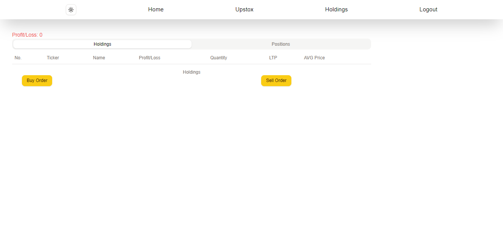
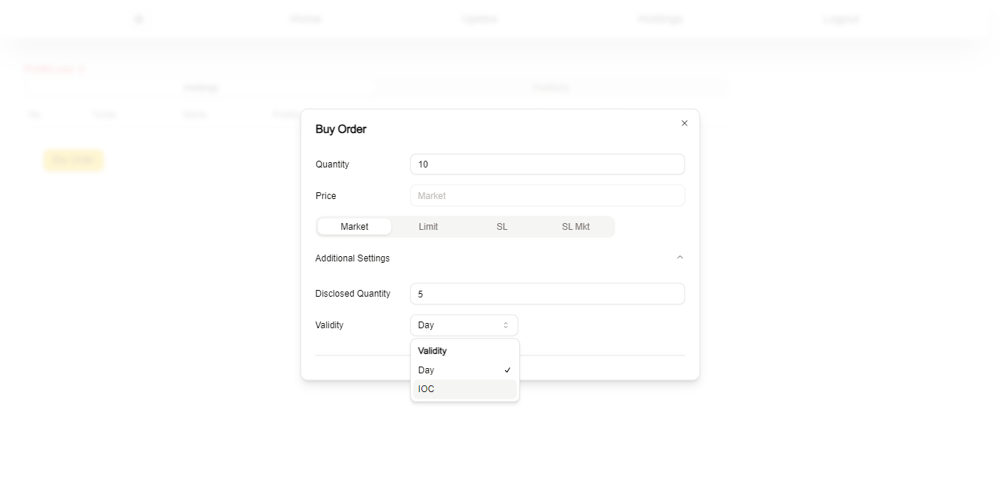

# Sypto Upstox

Its a upstox portfolio tracker which shows all the holdings, positions by upstox's v2 free api.

You need to open an upstox developer account and generate the api key and secret by setting up an app.
Refer to the documentation provided by the upstox on how to use their api.

## Screenshots

## Environment Variables

To run this project, you will need to add the following environment variables to your .env file

`NEXT_PUBLIC_UPSTOX_CLIENT_ID`

`NEXT_PUBLIC_UPSTOX_CLIENT_SECRET`

`NEXT_PUBLIC_UPSTOX_BASE_API`

`NEXT_PUBLIC_UPSTOX_URL`
